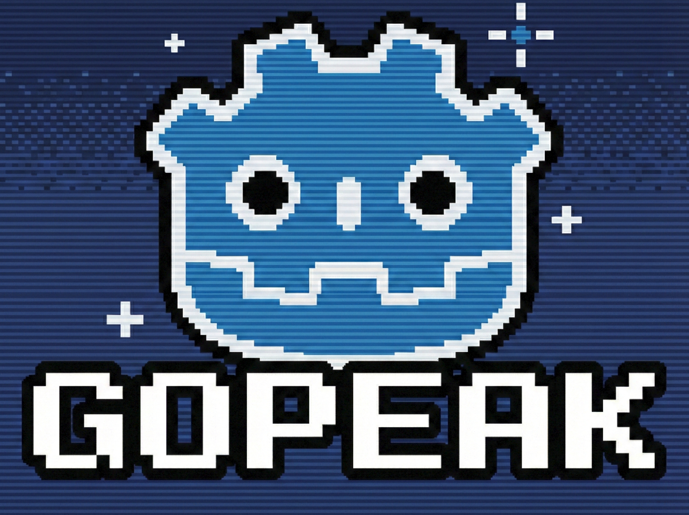
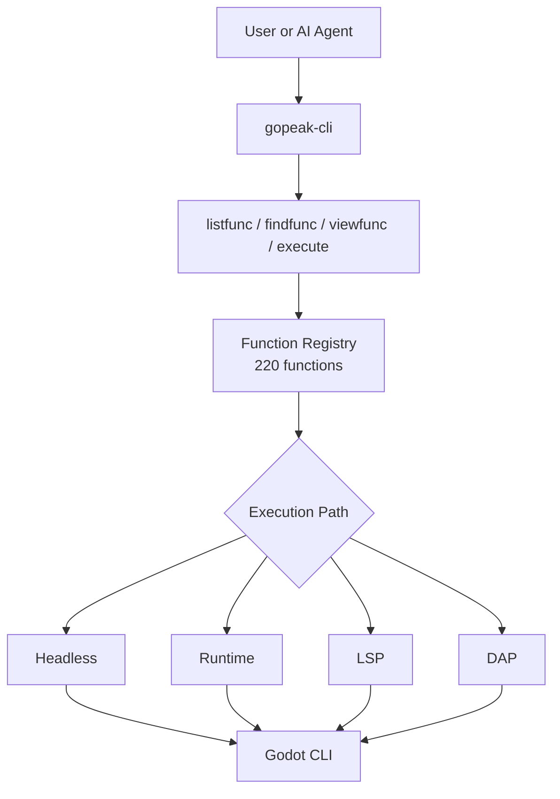

# GoPeak CLI

<p align="center">
  
</p>

[](https://www.npmjs.com/package/gopeak-cli)
[](LICENSE)
[](https://godotengine.org)
[](https://www.typescriptlang.org/)

**GoPeak CLI is a compact Godot automation CLI and MCP server for humans and AI agents.**

It exposes **220 Godot functions** through **4 MCP meta-tools** instead of hundreds of individual tool registrations.
That means:

- less context waste
- faster tool discovery
- easier prompting
- simpler scaling as functions grow

---

## Why this CLI architecture is powerful

Traditional Godot MCP servers often register one tool per capability.
That becomes noisy, heavy, and expensive for AI clients.

GoPeak CLI uses a better pattern:

- **4 stable meta-tools** for discovery + execution
- **220 functions stored in a registry**
- **routing by execution engine** instead of one-tool-per-function
- **CLI and MCP sharing the same core**

### Result

- AI agents discover functions only when needed
- adding new functions does **not** bloat the MCP tool list
- terminal users get the same power without needing an MCP client

---

## How it works



### Mental model

1. **Discover** what exists
2. **Inspect** the function schema
3. **Execute** the function through the correct engine

---

## Core MCP tools

These are the only MCP tools exposed to clients:

- **`Godot.listfunc`** — list available functions
- **`Godot.findfunc`** — search functions by pattern
- **`Godot.viewfunc`** — inspect a function definition and schema
- **`Godot.execute`** — run a function with validated arguments

This is the main reason the system stays compact while still supporting 220 operations.

---

## Requirements

- **Node.js 18+**
- **Godot 4.x**
- Optional: an MCP-compatible client such as Claude Desktop, Cursor, Cline, Codex, or OpenCode

---

## Install

### Run without global install

```bash
npx gopeak-cli listfunc --format text
```

### Global install

```bash
npm install -g gopeak-cli
```

### Build from source

```bash
git clone https://github.com/HaD0Yun/Gopeak-godot-Cli.git
cd Gopeak-godot-Cli
npm install
npm run build
```

---

## Quick start

```bash
# Check environment
gopeak-cli doctor --format text

# List all functions
gopeak-cli listfunc --format text

# Search for something useful
gopeak-cli findfunc scene --format text

# Inspect a function
gopeak-cli viewfunc create_scene --format text

# Execute a function
gopeak-cli exec create_scene --args '{"scene_name":"Player","root_type":"CharacterBody2D"}' --format text
```

---

## CLI commands

```text
doctor
config
listfunc
findfunc
viewfunc
exec
daemon
setup
check
notify
star
uninstall
version
install-skill
```

### Most useful commands

```bash
# Environment check
gopeak-cli doctor --format text

# Find functions
gopeak-cli listfunc --category scene --format text
gopeak-cli findfunc breakpoint --format text

# Inspect one function
gopeak-cli viewfunc run_project --format text

# Execute with inline JSON args
gopeak-cli exec run_project --format text
gopeak-cli exec lsp_diagnostics --args '{"filePath":"res://scripts/player.gd"}' --format text
```

---

## Setup for AI CLI wrappers

GoPeak CLI can install shell hooks for update checks and optional GitHub star prompts.

### Default behavior

```bash
gopeak-cli setup
```

This installs a **passive** shell hook block.
It does **not** wrap third-party AI CLIs.

### Enable AI CLI wrapping

```bash
gopeak-cli setup --wrap-ai-clis
source ~/.bashrc
```

When enabled, GoPeak CLI can wrap detected commands such as:

- `claude`
- `claudecode`
- `codex`
- `cursor`
- `gemini`
- `copilot`
- `omc`
- `opencode`
- `omx`

Related commands:

```bash
gopeak-cli check
gopeak-cli notify
gopeak-cli star
gopeak-cli uninstall
```

---

## MCP configuration example

```json
{
  "mcpServers": {
    "gopeak-cli": {
      "command": "gopeak-cli",
      "args": [],
      "env": {
        "GODOT_FLOW_PROJECT_PATH": "/path/to/your/project",
        "GODOT_FLOW_GODOT_PATH": "/path/to/godot"
      }
    }
  }
}
```

### NPX mode

```json
{
  "mcpServers": {
    "gopeak-cli": {
      "command": "npx",
      "args": ["-y", "gopeak-cli"],
      "env": {
        "GODOT_FLOW_PROJECT_PATH": "/path/to/your/project"
      }
    }
  }
}
```

---

## Execution engines

GoPeak CLI routes functions through four backends:

- **Headless** — one-shot Godot CLI execution
- **Runtime** — communicate with a running game
- **LSP** — editor/language-server style inspection
- **DAP** — debugging workflows

This split is what makes the CLI flexible:

- use headless automation for deterministic project changes
- use runtime for live game interaction
- use LSP for code intelligence
- use DAP for debugging

---

## Why terminal-first matters

A strong CLI gives you:

- **scriptability** for automation
- **debuggability** when MCP clients hide details
- **repeatability** in CI and local workflows
- **one source of truth** shared by terminal users and AI agents

In short:

> **GoPeak CLI is not just an MCP wrapper. It is a real automation surface that also happens to power MCP well.**

---

## Verification

Useful commands when validating a setup:

```bash
gopeak-cli doctor --format text
npm run typecheck
npm run build
npm test
```

---

## License

MIT
